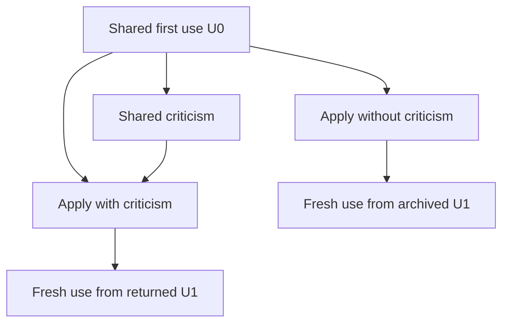

# E028: use the actual account and test criticism return

E028 links the complete selected E027 construction to the distinct `use_and_return_v1` template. Each of two configurations has one cycle with four stages. The original candidate remains unchanged, including ambiguities and reservations. The initializer explicitly attributes its concrete JSON representation, row-ID indexes and cached output to the operator; the model may infer a coherent missing operation, retain an uncertainty or suspend.

| Stage | Actual variable input | Required public contribution |
|---|---|---|
| use_before | Initial retained state only | Apply two legal deletions, report state/output after each, disclose interpretation; produce U0 |
| criticize_dependency | Actual U0; exact prior event list | Criticize its account/interpretation/state/use, or find no valid criticism |
| apply_return | Same U0 and exact prior event list; criticism port only in returned condition | Retain, revise, withdraw or suspend; identify U0 parent and produce complete U1 |
| use_after | Only that branch's actual U1 | Apply four fresh legal events, report each state/output and preserve unaffected key9 |



The returned configuration makes four unique calls. The archived configuration reuses the exact first two actual public responses only after its actual Mini briefs, provider payloads and settings match; it then makes two unique calls. Reused prefix deliveries have source-occurrence references and zero additional provider tokens. There are eight engine stage executions and at most six unique provider calls. No construction call is repeated. The criticism remains recorded in both configurations and reaches apply_return only through the returned condition's explicit port.

Stable source and full candidate are carried in a frozen system message with explicit quoted/fallible framing. Each variable user message comes from the validated actual Mini brief, removing only the precise host JSON-return suffix. This representation resolves Mini's existing4000-character per-kind instruction ceiling without truncating prose or changing Mini. It is an attributed prompt-role choice, not a declaration that candidate claims are authoritative.

The original source and candidate are available at every stage. Initial retained state is supplied only to use_before. The critic has no separate original initialization and must scope historical claims to actual U0. Both apply instructions carry the same exact prior-event list so criticism is not the sole route to that raw task information. use_after has no separate initialization, U0 or criticism port: information it uses must be carried in its own U1 or the stable source/candidate.

The two initial-use events delete the NULL-key left row and one of two duplicate-valued right matches. Fresh use reuses the deleted left ID, removes the last key7 match, inserts an actual NULL-valued right match, then inserts value c. The final insertion makes real-NULL versus null-extension state visibly relevant. An independent [SQLite oracle](../../experiments/diagnostics/E028-sql-event-oracle/oracle.json) verifies all six finite event obligations and unaffected key9. It is operator-only and is not read by preparation/runtime or included in prompts. No root criticism or reference incremental algorithm is supplied to the critic.

## Exact identity and execution

The frozen plan is `0e7ada3e11b348b7c3ea46805910ece3e14fdb700975e6a22b58b44c82569b5f`. Adapter SHA256 is `9701f7a7fef09b089643f5b7989913c8efae09a48a7453b55b54579a57ccb702`; system-message SHA256 is `4e35e4f56c78839780a58632a089fadc8e62e357b157a518db04ea05325ffe34`. All10 focused tests pass independently, including exact prefix reuse, source/port isolation, frozen-material changes, full-prose custody and first operational failure stopping execution. Actual-source preflight uses scripted responses and has zero provider calls.

Each unique call uses deepseek-flash with thinking disabled and an8192 completion-token ceiling, at most49152 additional completion tokens plus prompt usage. Execution is sequential with no retries. Original code, source, candidate, parent provenance, manifests, system message and initializer are verified before spending. A complete run still confers no semantic standing, and prose need not satisfy a response schema to remain admissible.

From an installed checkout:

```sh
python -m minireason.sql_use_return_study verify --repo . --root experiments/plans/E028-sql-use-return
python -m minireason.sql_use_return_study run --repo . --root experiments/plans/E028-sql-use-return --output experiments/records/E028-sql-use-return --expected-plan-id 0e7ada3e11b348b7c3ea46805910ece3e14fdb700975e6a22b58b44c82569b5f
```

The recovered session uses `PYTHONPATH=src:/workspace/scratch/9be47893c9a9/h-EPI/.venv/lib/python3.12/site-packages` and Python3.12.14 with exact declared dependencies. Set DEEPSEEK_API_KEY only in the process environment at the authorized destination https://api.deepseek.com/v1/chat/completions. Read STATUS/ledger, verify publication, record dispatch and ensure the output directory is absent before running. Preserve interrupted output; never overwrite or automatically rerun it.

Publish complete or partial observations before successor work. Review whether initial use already inferred the omitted removal, whether criticism has actual bearing, what each U1 retained/changed, whether every fresh output/state meets the finite oracle, and whether protected uses survive. Correct use before criticism cannot be attributed to later repair. Raw U0 can already suffice, and single differing samples do not isolate stochastic variation. This study tests a criticism-delivery route; it does not complete the native comparison, establish Mini superiority or certify creativity.
